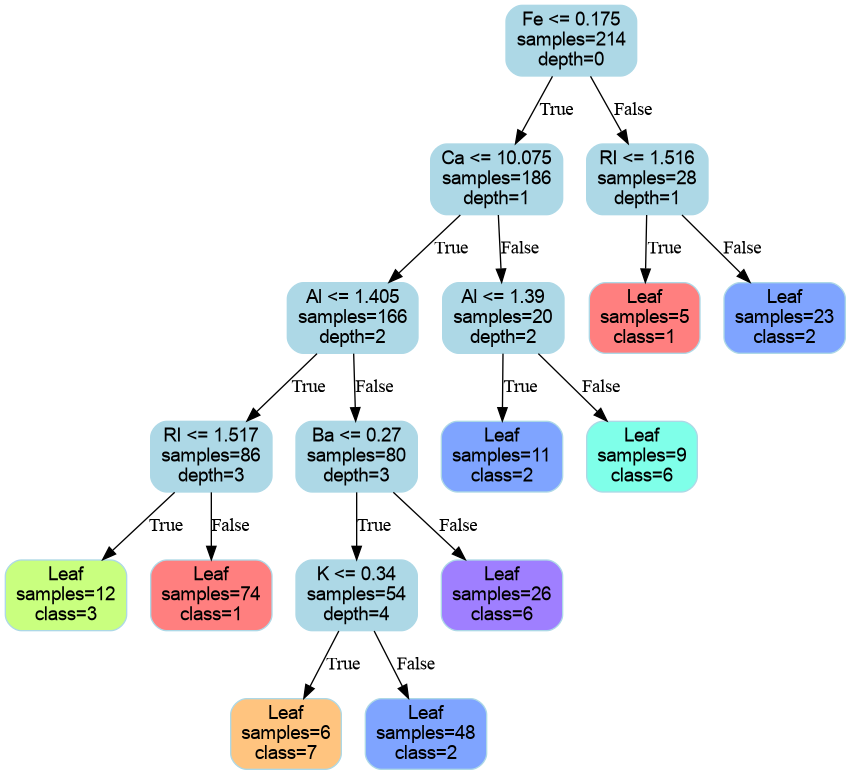

# genTree

**genTree** is an evolutionary algorithm for generating decision trees, implemented in Python and Cython. It can build trees for both classification and regression problems, optimizing the structure using genetic techniques such as mutation, crossover, and pruning.



## Project Structure

- `genTree/`
  - `genTree.pyx`, `decisionNode.pyx`, `__init__.py`: main implementation in Cython.
  - `utils.py`: utility functions for tree visualization.
- `main/`
  - script for visualizing results (accuracy and complexity) with boxplots.

## Algorithm Details

### Genetic Operators (Mutations)

- **split_random_leaf**: Randomly selects a leaf and tries to split it with a random feature and threshold.
- **prune_random_leaf**: Finds a node whose children are leaves and replaces it with a single leaf.
- **prune_random_node**: Randomly selects an internal node and prunes it if possible.
- **major_split**: Randomly selects a node and, with 50% probability, changes its split feature and threshold, otherwise only the threshold.
- **minor_split**: Randomly selects a node and slightly shifts its split threshold.
- **change_root_split**: Changes the split feature and/or threshold of the root node.

### Evolutionary Fit Algorithm

The `fit` method performs an evolutionary search for the best tree:

**Pseudocode:**
```
Initialize a population of random trees
For each generation:
    Evaluate the fitness (loss) of each tree
    Select the top-performing trees (elitism)
    For the rest of the population:
        - Select parents probabilistically (better fitness = higher chance)
        - Apply crossover to generate a child
        - With some probability, apply a random mutation to the child
    Replace the old population with the new one
Return the best tree found
```
- Fitness is computed as a combination of prediction error and tree complexity (regularization).
- Selection is probabilistic, favoring trees with lower loss.
- Multiple mutation operators are available and chosen at random.

## Additional Notes

- For multi-class classification, labels must be consecutive integers starting from 0.
- For regression, set `is_regression=True` and use float targets.
- To generate boxplots of accuracy and complexity, run:
  ```bash
  python main/boxplot.py
  ```
  The plots will be saved in the `graphs/` folder.

## Requirements

- Python >= 3.8
- Cython >= 0.29
- NumPy
- Matplotlib
- Pandas
- graphviz (Python library and system binary)
- setuptools

**Note:** You need a C compiler (e.g. `gcc`) and the `dot` binary from Graphviz available in your system PATH.

## Installing Dependencies

```bash
pip install numpy cython matplotlib pandas graphviz
# On Ubuntu/Debian for the graphviz binary:
sudo apt-get install graphviz
```

## Building the Cython Module

A `setup.py` file is already provided in the project. To build the Cython extension, simply run:

```bash
python setup.py build_ext --inplace
```

This will generate the `.so` files needed to import `genTree` from Python.

## Usage

Basic usage example:

```python
from genTree import genTree
import numpy as np

# Example data
X = np.random.rand(100, 5)
y = np.random.randint(0, 2, size=100)

# Initialize and train the genetic tree
model = genTree(max_depth=5, min_samples_leaf=2, is_regression=False, pop_size=50, n_generations=20)
model.fit(X, y)

# Prediction
y_pred = model.predict(X)

# Visualize the best tree
from genTree.utils import plot_tree
plot_tree(model.best_tree, filename="tree", features_name=[f"f{i}" for i in range(X.shape[1])], class_names=["Class 0", "Class 1"])
```
